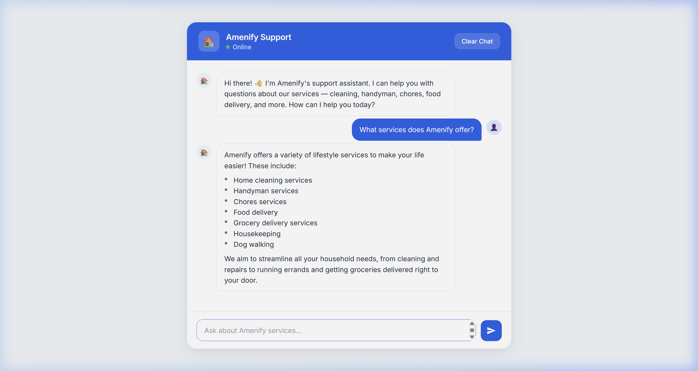
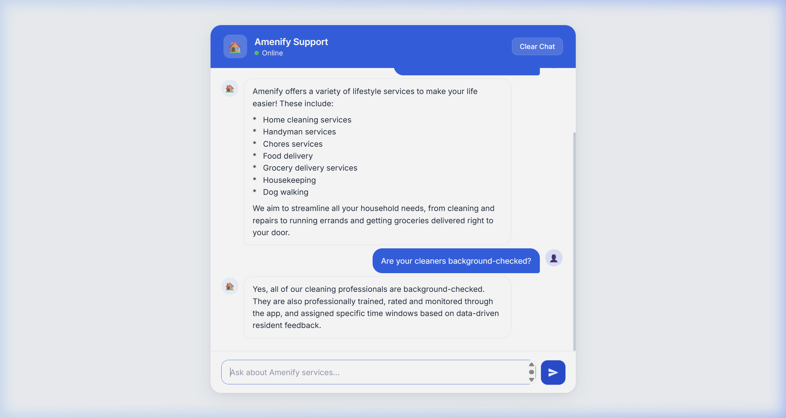

<p align="center">
  
</p>

<h1 align="center">🏠 Amenify AI Customer Support Bot</h1>

<p align="center">
  <strong>An intelligent, RAG-powered support chatbot built from scratch — no chatbot frameworks used.</strong>
</p>

<p align="center">
  <a href="https://amenify-bot-221685338300.us-central1.run.app">
    
  </a>
</p>

<p align="center">
  
  
  
  
  
</p>

---

## 📸 Live Demo

> **Try it now →** [amenify-bot-221685338300.us-central1.run.app](https://amenify-bot-221685338300.us-central1.run.app)

<p align="center">
  
</p>

<p align="center">
  
</p>

---

## 🧠 What This Is

A **production-ready AI support bot** for [Amenify](https://amenify.com) that:

- ✅ **Answers only from real Amenify data** — scraped directly from amenify.com (16 pages, 55 knowledge chunks)
- ✅ **Refuses to hallucinate** — responds *"I don't know"* for off-topic questions and directs users to human support
- ✅ **Maintains conversation context** — session-based chat history for natural multi-turn conversations
- ✅ **Zero chatbot frameworks** — built from scratch using raw API calls (no LangChain, LlamaIndex, or Dialogflow)
- ✅ **Deployed & live** — containerized with Docker, running on Google Cloud Run

---

## 🏗️ Architecture

```
┌─────────────────────────────────────────────────────────────────┐
│                        USER (Browser)                           │
│                                                                 │
│   ┌─────────────────────────────────────────────────────────┐   │
│   │          Single-File Chat UI (HTML/CSS/JS)              │   │
│   │   • Amenify brand design (#2563eb)                      │   │
│   │   • Quick-reply chips, typing indicator                 │   │
│   │   • Auto-resizing input, smooth animations              │   │
│   └────────────────────────┬────────────────────────────────┘   │
└────────────────────────────┼────────────────────────────────────┘
                             │ REST API
                             ▼
┌────────────────────────────────────────────────────────────────┐
│                    FastAPI Backend                              │
│                                                                │
│   POST /api/session  →  Create new chat session                │
│   POST /api/chat     →  Send message, get AI response          │
│   DELETE /api/session →  Clear chat history                     │
│   GET  /api/health   →  Health check + KB status               │
│                                                                │
│   ┌──────────────────────────────────────────────────────┐     │
│   │              RAG Pipeline (Custom-Built)              │     │
│   │                                                      │     │
│   │   1. Receive user query                              │     │
│   │   2. Embed query → Gemini Embedding API              │     │
│   │   3. Vector search → ChromaDB (top-5 chunks)         │     │
│   │   4. Build context-grounded prompt                   │     │
│   │   5. Generate answer → Gemini 2.5 Flash Lite         │     │
│   │   6. Return answer + source attribution              │     │
│   └──────────────────────────────────────────────────────┘     │
│                                                                │
│   ┌──────────────────┐    ┌──────────────────────────────┐     │
│   │  Session Store   │    │  ChromaDB Vector Database    │     │
│   │  (In-Memory)     │    │  (Persistent, File-Based)    │     │
│   └──────────────────┘    └──────────────────────────────┘     │
└────────────────────────────────────────────────────────────────┘
```

### How RAG Prevents Hallucination

```
User asks: "What is the capital of France?"

  1. Retrieve  → Search ChromaDB for relevant Amenify content
  2. Context   → No relevant match found in knowledge base
  3. Prompt    → System instruction: "ONLY answer from provided context"
  4. Response  → "I don't know. Contact concierge@amenify.com or call 719-767-1963"
```

```
User asks: "What services does Amenify offer?"

  1. Retrieve  → Top-5 chunks about Amenify services returned
  2. Context   → Cleaning, handyman, chores, food delivery, dog walking...
  3. Prompt    → System instruction + retrieved context injected
  4. Response  → Accurate, structured answer listing all services ✓
```

---

## 📁 Project Structure

```
Amenify/
├── backend/
│   ├── main.py              # FastAPI app — routes, CORS, session management
│   ├── rag.py               # RAG pipeline — retrieval + Gemini generation
│   ├── ingestion.py         # Chunking + embedding + ChromaDB storage
│   ├── scraper.py           # BeautifulSoup crawler for amenify.com
│   ├── knowledge_base.json  # Pre-scraped content (16 pages)
│   ├── requirements.txt     # Python dependencies
│   └── chroma_db/           # Persistent vector store (auto-generated)
│
├── frontend/
│   └── index.html           # Self-contained chat UI (no frameworks)
│
├── docs/images/             # Screenshots for README
├── Dockerfile               # Container config for Cloud Run
├── .dockerignore
├── .env.example             # Environment variable template
└── README.md
```

---

## ⚙️ Tech Stack

| Layer | Technology | Why? |
|-------|-----------|------|
| **Backend** | Python 3.11, FastAPI | Fast async API, auto-generated docs at `/docs` |
| **LLM** | Google Gemini 2.5 Flash Lite | Free tier, fast inference, high accuracy |
| **Embeddings** | Gemini Embedding 001 | Free, 768-dim vectors, great semantic quality |
| **Vector DB** | ChromaDB (persistent) | Zero-config, file-based, no external infra needed |
| **Scraping** | BeautifulSoup4, Requests | Lightweight, targeted content extraction |
| **Frontend** | Vanilla HTML/CSS/JS | Single file, no build step, no frameworks |
| **Deployment** | Docker + Google Cloud Run | Serverless, auto-scaling, pay-per-request |

---

## 🚀 Quick Start

### Prerequisites

- Python 3.11+
- Google Gemini API Key — **free** at [aistudio.google.com](https://aistudio.google.com/apikey)

### 1. Clone & Install

```bash
git clone https://github.com/YOUR_USERNAME/amenify-support-bot.git
cd amenify-support-bot

pip install -r backend/requirements.txt
```

### 2. Configure API Key

```bash
cp .env.example .env
# Edit .env → add your GEMINI_API_KEY
```

### 3. Build Knowledge Base

```bash
python -m backend.ingestion
# Output: [DONE] Knowledge base built with 55 chunks
```

### 4. Run

```bash
uvicorn backend.main:app --port 8000
# Open http://localhost:8000
```

---

## 🐳 Docker Deployment

### Run Locally with Docker

```bash
docker build -t amenify-bot .
docker run -p 8080:8080 -e GEMINI_API_KEY=your-key-here amenify-bot
```

### Deploy to Google Cloud Run

```bash
gcloud run deploy amenify-bot \
  --source . \
  --region us-central1 \
  --allow-unauthenticated \
  --set-env-vars GEMINI_API_KEY=your-key-here \
  --memory 1Gi
```

---

## 🔌 API Reference

### Create Session

```bash
curl -X POST https://amenify-bot-221685338300.us-central1.run.app/api/session
```

```json
{ "session_id": "a1b2c3d4-..." }
```

### Send Message

```bash
curl -X POST https://amenify-bot-221685338300.us-central1.run.app/api/chat \
  -H "Content-Type: application/json" \
  -d '{"message": "What services do you offer?", "session_id": "a1b2c3d4-..."}'
```

```json
{
  "response": "Amenify offers a variety of lifestyle services...",
  "sources": ["https://amenify.com/resident-services", "https://amenify.com"],
  "session_id": "a1b2c3d4-..."
}
```

### Health Check

```bash
curl https://amenify-bot-221685338300.us-central1.run.app/api/health
```

```json
{
  "status": "healthy",
  "knowledge_base": "ready",
  "active_sessions": 3
}
```

---

## 🧪 Testing & Validation

| Test Case | Input | Expected | Result |
|-----------|-------|----------|--------|
| On-topic service query | "What services does Amenify offer?" | Lists cleaning, handyman, chores, etc. | ✅ Pass |
| On-topic safety query | "Are cleaners background-checked?" | Confirms background checks + training | ✅ Pass |
| Off-topic (hallucination test) | "What is the capital of France?" | "I don't know" + support contact info | ✅ Pass |
| Session continuity | Follow-up questions | Maintains context across turns | ✅ Pass |
| Empty message | "" | 400 Bad Request | ✅ Pass |

---

## 🎨 Design Decisions

### Why Custom RAG Instead of a Framework?

The assignment explicitly requires **no chatbot frameworks**. Instead of reaching for LangChain or LlamaIndex, I built each pipeline stage manually:

1. **Scraping** → Custom `BeautifulSoup` crawler targeting 16 key Amenify pages
2. **Chunking** → `RecursiveCharacterTextSplitter` (500 tokens, 50 overlap) for optimal retrieval
3. **Embedding** → Direct Gemini API calls via ChromaDB's embedding function integration
4. **Retrieval** → Cosine similarity search returning top-5 most relevant chunks
5. **Generation** → Gemini API with strict system prompt enforcing grounded answers

### Why Pre-Scraped Knowledge Base?

The `knowledge_base.json` file contains pre-scraped content so the bot works reliably on first startup without needing to hit amenify.com. The scraper can be re-run anytime to refresh the data.

### Why Single-File Frontend?

A single `index.html` with embedded CSS and JS means:
- Zero build tools or bundlers needed
- Works immediately when served by FastAPI
- Easy to inspect — all code is visible in one file
- Responsive and accessible on mobile

---

## 📊 Knowledge Base Coverage

Content scraped and indexed from **16 pages** across amenify.com:

| Page | Content |
|------|---------|
| Homepage | Company overview, value proposition |
| About Us | Mission, founding story |
| Resident Services | Full service catalog |
| Cleaning Services | Standard, deep, move-out cleaning details |
| Handyman Services | Repair and maintenance offerings |
| Chores Services | Task-based assistance |
| Food & Grocery | Delivery service details |
| Dog Walking | Pet care services |
| Moving Services | Professional moving assistance |
| Property Managers | B2B partnership info |
| Resident Protection Plan | Insurance/protection details |
| Amenify Technology | Platform & tech stack |
| API Partners | Integration options |
| Commercial Cleaning | Business cleaning services |
| Leasing Concession | Resident perks |
| Resident Gifts | Gift program details |

---

## 📝 License

Built for the Amenify Software Engineering Summer Internship 2026 interview assignment.

---

<p align="center">
  <strong>Built with ❤️ by Smit Donga</strong><br/>
  <a href="https://amenify-bot-221685338300.us-central1.run.app">Live Demo</a> · 
  <a href="mailto:concierge@amenify.com">Amenify Support</a>
</p>
